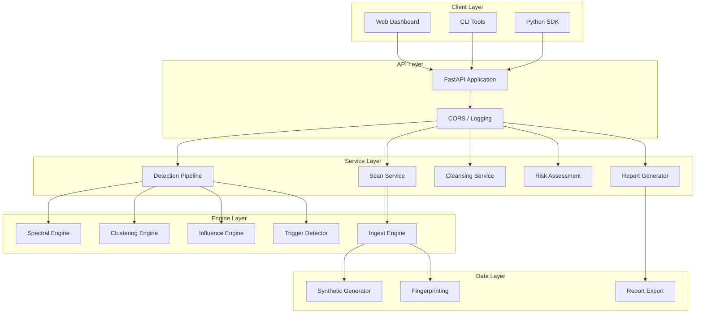
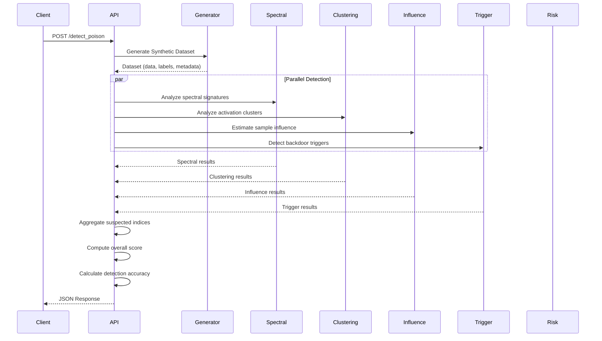
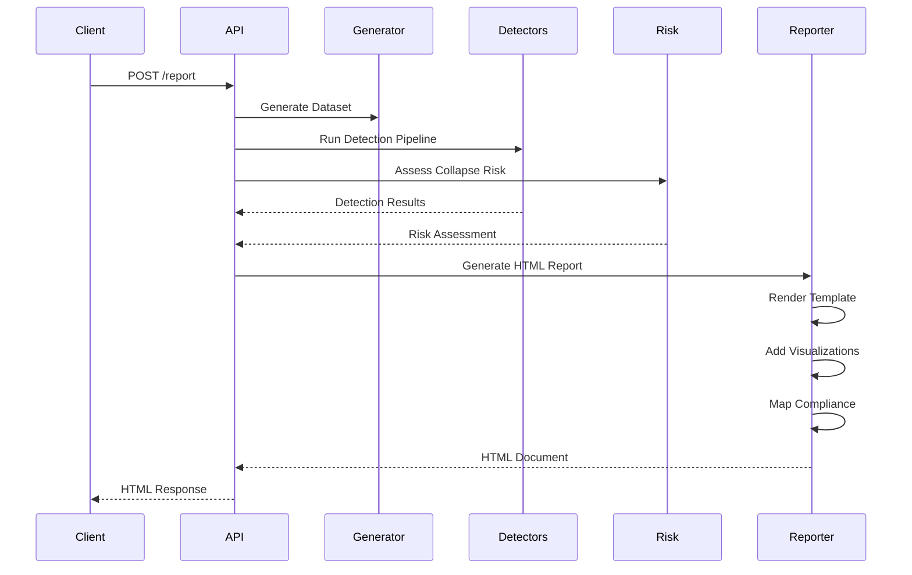
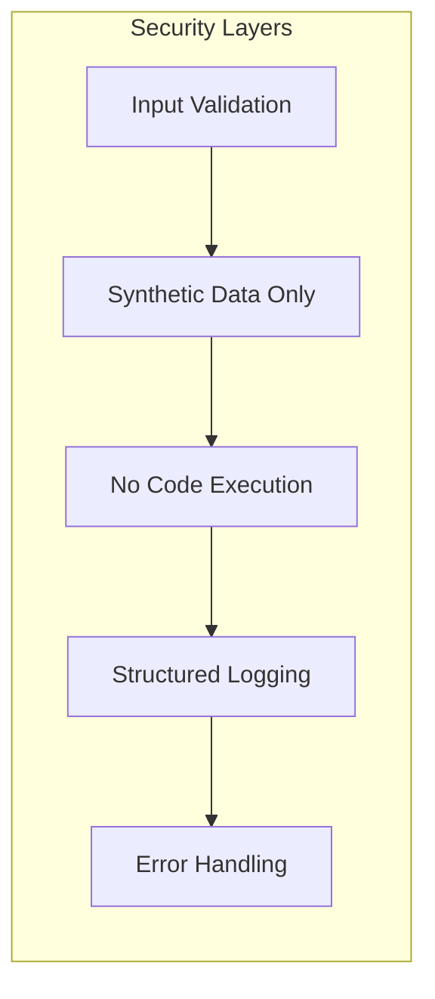

# Architecture Overview

Comprehensive architecture documentation for the Data Poisoning Detection Tool.

## Table of Contents

- [System Design](#system-design)
- [Component Architecture](#component-architecture)
- [Data Flow](#data-flow)
- [Detection Pipeline](#detection-pipeline)
- [Technology Stack](#technology-stack)
- [Security Architecture](#security-architecture)
- [Deployment Options](#deployment-options)

---

## System Design

The Data Poisoning Detection Tool follows a **modular, layered architecture** designed for:

- ✅ **Extensibility**: Easy to add new detection algorithms
- ✅ **Testability**: Components are loosely coupled
- ✅ **Scalability**: Can be containerized and distributed
- ✅ **Maintainability**: Clear separation of concerns

### High-Level Architecture



---

## Component Architecture

### 1. API Layer (`backend/api/`)

The API layer handles HTTP routing and request/response processing.

| Module | Endpoint | Responsibility |
|--------|----------|----------------|
| `scan.py` | `/scan` | Dataset validation & fingerprinting |
| `poison.py` | `/detect_poison` | Orchestrates detection pipeline |
| `clean.py` | `/clean` | Dataset cleaning operations |
| `collapse.py` | `/collapse_risk` | Risk assessment |
| `report.py` | `/report` | Report generation |

**Key Features**:
- Pydantic models for request/response validation
- Async endpoint handlers
- Structured error responses

### 2. Engine Layer (`backend/engines/`)

The engine layer contains the core detection and processing algorithms.

#### Ingest Engine (`ingest_engine.py`)

Generates and validates synthetic datasets.

```python
class SyntheticDataGenerator:
    """Generates synthetic datasets for testing."""
    
    def generate_image_dataset(...) -> SyntheticDataset
    def generate_text_dataset(...) -> SyntheticDataset
    def generate_tabular_dataset(...) -> SyntheticDataset

class DatasetValidator:
    """Validates dataset quality and integrity."""
    
    def validate(dataset) -> ValidationResult
```

**Supported Data Types**:
- 🖼️ **Image**: MNIST-like grayscale images (28x28x1)
- 📝 **Text**: Token sequences (100 tokens)
- 📊 **Tabular**: Numeric features (20 dimensions)

#### Spectral Engine (`spectral_engine.py`)

Detects poisoning using spectral signatures.

```
Algorithm (Tran et al., NeurIPS 2018):
1. Input: Data matrix X ∈ ℝ^(n×d), labels y
2. Center: X̃ = X - mean(X)
3. SVD: X̃ = UΣV^T
4. For each class c:
   a. Project class samples onto top singular vector
   b. Compute z-scores of projections
   c. Flag samples with |z| > threshold
5. Output: Suspected indices, scores
```

#### Activation Clustering (`activation_clustering.py`)

Analyzes neural network activation patterns.

```
Algorithm:
1. Extract activations (simulated via random projection)
2. For each class:
   a. Apply K-Means or DBSCAN clustering
   b. Identify minority clusters
   c. Check label alignment
3. Flag samples in misaligned clusters
```

#### Influence Engine (`influence_engine.py`)

Estimates sample influence on model training.

```
Simplified Influence Estimation:
1. Compute gradient-like scores for each sample
2. Identify samples with high impact (positive or negative)
3. Rank by influence magnitude
```

#### Trigger Detector (`trigger_detector.py`)

Detects backdoor triggers in data.

| Data Type | Detection Method |
|-----------|------------------|
| Image | Patch detection, corner analysis, intensity patterns |
| Text | Rare tokens, repeated sequences, position analysis |
| Tabular | Statistical outliers, distribution anomalies |

#### Risk Engine (`risk_engine.py`)

Computes model training risk scores.

```
Risk Factors:
- Overfit Potential: dim(data) / n_samples
- Representation Collapse: variance analysis
- Boundary Distortion: inter-class distances
- Poisoning Density: suspected / total samples
- Trigger Confidence: detection confidence
```

#### Cleanser (`cleanser.py`)

Removes or relabels poisoned samples.

| Mode | Strategy |
|------|----------|
| STRICT | Remove all suspected samples |
| SAFE | Remove only high-confidence detections |
| REVIEW | Return suggestions without modification |

### 3. Utility Layer (`backend/utils/`)

Shared utilities and helpers.

| Module | Purpose |
|--------|---------|
| `logger.py` | Structured logging with rotation |
| `hash_utils.py` | SHA-256 fingerprinting |
| `visuals.py` | Matplotlib visualizations |
| `pdf_export.py` | Report generation |

---

## Data Flow

### Detection Pipeline Flow



### Report Generation Flow



---

## Technology Stack

### Backend

| Technology | Purpose | Version |
|------------|---------|---------|
| Python | Core language | 3.9+ |
| FastAPI | Web framework | 0.104+ |
| Pydantic | Data validation | 2.5+ |
| NumPy | Numerical computing | 1.24+ |
| SciPy | Scientific computing | 1.11+ |
| scikit-learn | ML algorithms | 1.3+ |
| Matplotlib | Visualization | 3.8+ |
| uvicorn | ASGI server | 0.24+ |

### Frontend

| Technology | Purpose |
|------------|---------|
| HTML5 | Structure |
| CSS3 | Styling (dark theme) |
| JavaScript | Interactivity |

### DevOps

| Technology | Purpose |
|------------|---------|
| Docker | Containerization |
| GitHub Actions | CI/CD |
| pytest | Testing |
| mypy | Type checking |
| Black | Code formatting |

---

## Security Architecture

### Design Principles



### Security Controls

| Control | Implementation |
|---------|----------------|
| **Input Validation** | Pydantic schemas for all inputs |
| **Synthetic Data** | Only generates simulated data |
| **No Execution** | Static analysis only, no code execution |
| **CORS** | Configurable cross-origin policy |
| **Logging** | Audit trail without sensitive data |

### Data Flow Security

1. **Input**: All parameters validated against schema
2. **Processing**: No external data access
3. **Output**: Structured, predictable responses
4. **Storage**: No persistent data storage

---

## Deployment Options

### Local Development

```bash
uvicorn backend.main:app --reload --port 8000
```

### Docker Container

```dockerfile
FROM python:3.11-slim
WORKDIR /app
COPY . .
RUN pip install -r requirements.txt
EXPOSE 8000
CMD ["uvicorn", "backend.main:app", "--host", "0.0.0.0"]
```

### Docker Compose

```yaml
services:
  detector:
    build: .
    ports:
      - "8000:8000"
    healthcheck:
      test: ["CMD", "curl", "-f", "http://localhost:8000/health"]
```

### Kubernetes (Example)

```yaml
apiVersion: apps/v1
kind: Deployment
metadata:
  name: dpdt
spec:
  replicas: 3
  template:
    spec:
      containers:
        - name: dpdt
          image: ghcr.io/raoof128/dpdt:latest
          ports:
            - containerPort: 8000
          livenessProbe:
            httpGet:
              path: /health
              port: 8000
```

---

## Extension Points

### Adding a New Detection Algorithm

1. Create engine in `backend/engines/`
2. Implement detection interface
3. Register in detection pipeline
4. Add API endpoint if needed
5. Update tests

```python
# backend/engines/my_detector.py
class MyDetector:
    def detect(self, data: np.ndarray, labels: np.ndarray) -> DetectionResult:
        # Implementation
        pass
```

### Adding a New Data Type

1. Extend `SyntheticDataGenerator`
2. Add trigger detector support
3. Update API validation
4. Add tests

---

## Performance Considerations

| Operation | Complexity | Optimization |
|-----------|------------|--------------|
| Spectral Analysis | O(n²) | Batch processing |
| Clustering | O(n log n) | Configurable k |
| Influence | O(n) | Sampling |
| Full Pipeline | O(n²) | Parallel execution |

---

## Future Architecture

### Planned Enhancements

- [ ] GPU acceleration for large datasets
- [ ] Distributed processing with Ray/Dask
- [ ] Real-time streaming detection
- [ ] Model-specific detectors (CNN, Transformer)
- [ ] Federated detection capabilities
