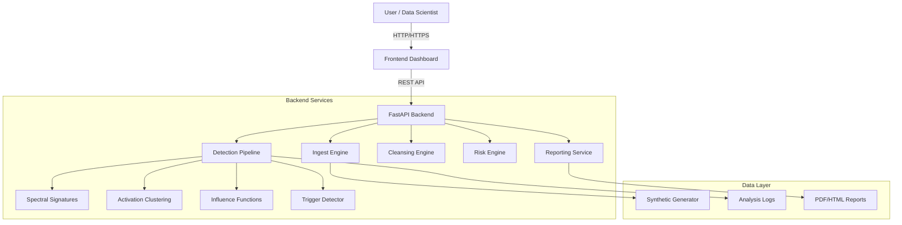
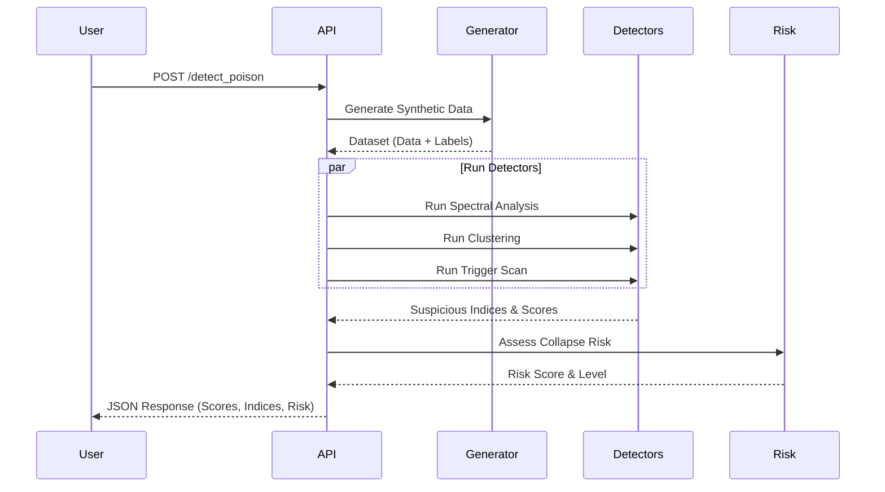

# Architecture Overview

## System Design

The Data Poisoning Detection Tool follows a modular, service-oriented architecture designed for scalability and extensibility.

### High-Level Architecture

## Component Details

### 1. Ingest Engine
- **Responsibility**: Generates and validates synthetic datasets.
- **Key Features**:
  - Supports Image (MNIST-like), Text, and Tabular data.
  - Validates schema, distribution, and integrity.
  - Computes SHA-256 fingerprints for provenance.

### 2. Detection Pipeline
Orchestrates multiple detection strategies to identify poisoning:

- **Spectral Signatures**:
  - Uses SVD/PCA to project data into lower dimensions.
  - Identifies outliers based on singular vector magnitude.
  - Effective against backdoor attacks that create separable subspaces.

- **Activation Clustering**:
  - Simulates neural network feature extraction.
  - Clusters activations using K-Means or DBSCAN.
  - Flags clusters that are misaligned with their labels (e.g., a "dog" cluster inside the "cat" class).

- **Influence Functions**:
  - Estimates the impact of each training sample on the model.
  - High negative influence suggests harmful/poisoned samples.

- **Trigger Detector**:
  - Scans for specific patterns:
    - **Vision**: Pixel patches, corner watermarks.
    - **Text**: Rare token sequences, repeated substrings.
    - **Tabular**: Extreme value outliers.

### 3. Risk Engine
Assesses the overall safety of the dataset for training:
- **Overfit Potential**: Checks dimensionality vs. sample size.
- **Representation Collapse**: Analyzes feature variance.
- **Boundary Distortion**: Measures inter-class separability.

### 4. Cleansing Engine
Provides mechanisms to sanitize datasets:
- **Strict Mode**: Removes all flagged samples.
- **Safe Mode**: Removes only high-confidence detections.
- **Review Mode**: Tags samples for human review.

## Data Flow

### Detection Flow

## Security Considerations

1. **Synthetic Data**: The system strictly uses synthetic data generation to prevent handling real malicious payloads.
2. **Input Validation**: All API inputs are validated using Pydantic schemas.
3. **No Execution**: The tool analyzes data statically and does not execute any code contained within data samples.
